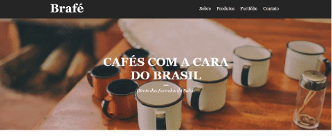
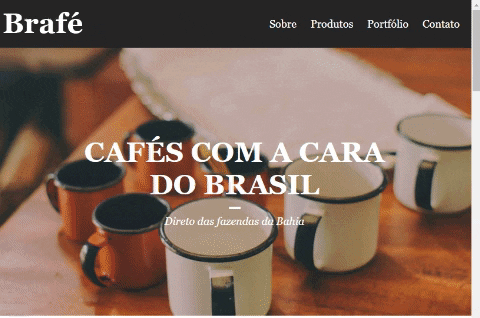

<h1>Webpage Project 02 - Brafé</h1> 

Webpage construída para testar diferentes formas de estilizar uma aplicação com Css.
 
<h2>O que será testado na mesma aplicação:</h2> 

1. Puro

2. Grid

3. Flexbox

4. Bootstrap

<h2>Webpage:</h2>

<h2>Responsividade - Tablet:</h2>

<h2>Responsividade - Mobile:</h2>

