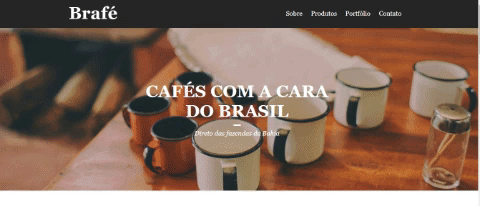

<h1>Webpage Project 02 - Brafé</h1> 

Webpage construída para testar diferentes formas de utilizar o Css numa page. Aqui irei fazer para uma mesma aplicação a "estilização" utilizando Css puro, Grid, FLexbox e bootstrap como forma de estudo fazendo um paralelo entre as possíveis formas de se utilizar css numa aplicação web bem como os seus níveis de complexidade.
 

<b>OBS.: Aqui o foco não será o conteúdo em html, mas sim, o css que será aplicado para dá estilo à página.<b> 

<h2>Etapa 01 - Página Inicial</h2>

<h2>Etapa 02 - Section Produtos</h2>

